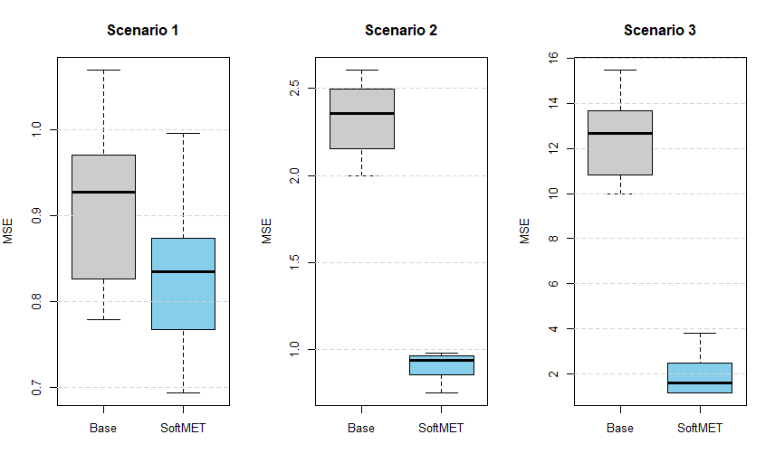

# SoftMET: Soft-membership Mixed Effects Trees

This repository contains the implementation and simulation study of the **SoftMET** algorithm. This approach integrates attention-based soft-partitioning within a 3-Trees mixed-effects framework to capture complex non-linearities in clustered data.

## 1. Overview
The core innovation of this model is replacing the classic "hard splits" of regression trees with **probabilistic assignments** using a Softmax attention mechanism. This allows the model to remain differentiable and provides smoother approximations of non-linear surfaces while maintaining the interpretability of Linear Mixed Models (LMM).

## 2. Methodology
The estimation follows a principled **Two-Stage Workflow**:
- **Stage 1 (Structural Selection):** An iterative backfitting procedure is used to optimize the routing parameters ($\theta$) for level-1, level-2, and cross-level trees using BFGS optimization.
- **Stage 2 (Final Inference):** Optimized soft-leaf probabilities are treated as continuous basis functions. The final model is fitted via `lmer`, allowing for standard Likelihood Ratio Tests (ANOVA) and formal inference on fixed/random components.

## 3. Simulation Design
We evaluated the model across three distinct Data Generating Processes (DGP):
* **Scenario 1:** Purely linear baseline.
* **Scenario 2:** Quasi-linear with threshold interactions (Threshold logic).
* **Scenario 3:** Complex non-linearities (Quadratic and Logarithmic interactions).

## 4. Key Results (Monte Carlo Evidence)
The simulation was conducted over multiple iterations to ensure the stability of the results. 

### Performance Summary Table
| Scenario | Statistical Power | MSE (Classic LMM) | MSE (SoftMET) | Improvement (%) |
| :--- | :---: | :---: | :---: | :---: |
| **Scenario 1** | 0.90 | 0.912 | 0.827 | 9.3% |
| **Scenario 2** | 1.00 | 2.329 | 0.906 | **61.1%** |
| **Scenario 3** | 1.00 | 12.575 | 1.881 | **85.0%** |

### Visual Comparison
The following boxplots demonstrate the predictive stability and significant MSE reduction achieved by SoftMET in non-linear settings:

## 5. Conclusion
SoftMET demonstrates superior predictive accuracy and high statistical power in detecting non-linear structures. Even in linear cases (Scenario 1), the model remains robust without overfitting significantly, while in complex settings (Scenario 3), it reduces the error by over 85% compared to traditional LMMs.

## How to Run
1. Ensure `lme4`, `MASS`, and `knitr` are installed.
2. Source the main script: `source("SoftMET_Simulation.R")`
3. The script will automatically generate the ANOVA table and initiate the Monte Carlo study.

---
*Developed for Thesis Research - May 2026*
